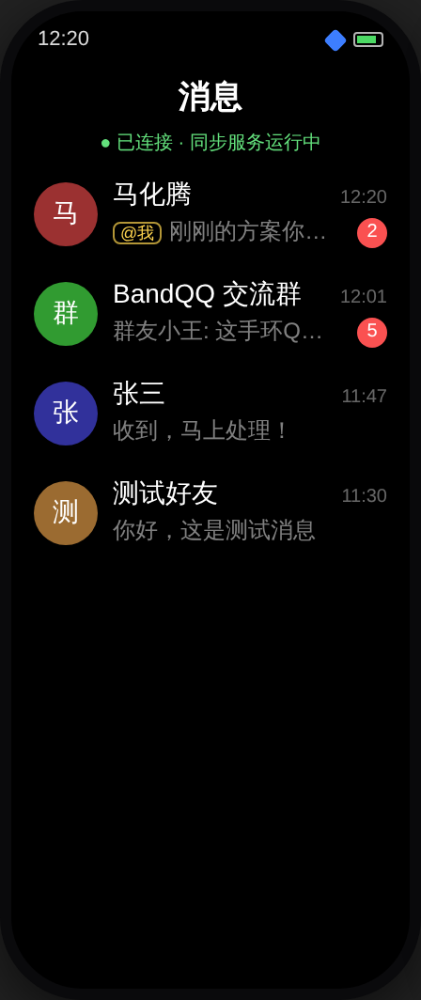
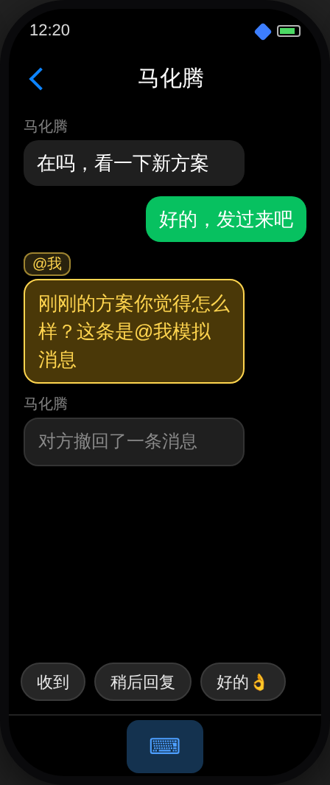
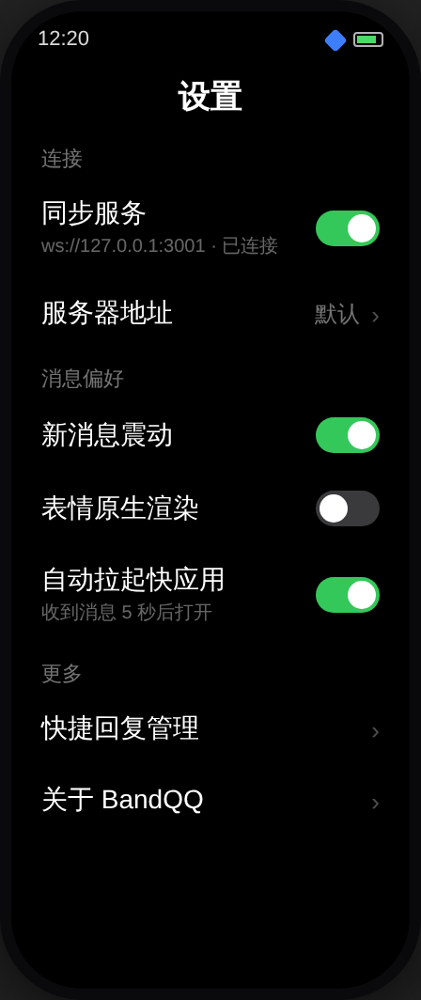
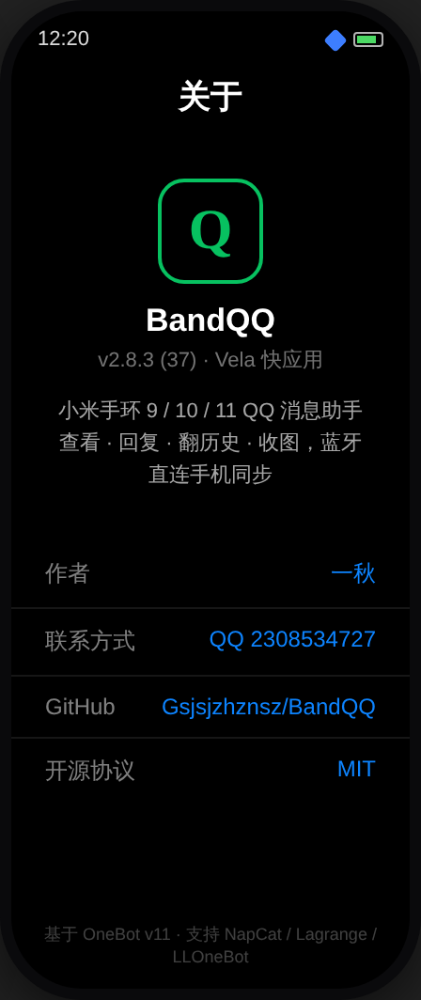

# BandQQ v2.8.3 — 小米手环 9/10/11 QQ 消息助手（手环快应用 + 安卓同步器）

> 🧠 **AI 协作记忆库**：[`MEMORY.md`](MEMORY.md) — 本项目的跨会话持久记忆（架构 / bug 台账 / 构建配方 / 任务清单）。任何新会话恢复上下文，先读它。

[]() []() []()

**BandQQ** 是一套开源的「小米手环 QQ 消息助手」双端方案：手环端运行 Vela 快应用（rpk），手机端运行安卓同步器（APK），通过小米互联蓝牙通道把 QQ 消息实时同步到手环，支持直接在手环上**查看 / 回复 / 翻历史消息 / 收图**。

## 界面预览（手环 10/11 · 212×520）

| 会话列表 | 聊天页（@我 金色高亮） |
|:---:|:---:|
|  |  |

| 设置 | 关于 |
|:---:|:---:|
|  |  |

> 被群友 @ 时：会话列表金色「@我」角标 + 聊天页「@我」徽标与高亮呼吸气泡 + 强震动提醒，三重感知不错过任何一条艾特。

> **上游仓库说明**：本项目上游为 [Astroptis/band-qq-assistant](https://github.com/Astroptis/band-qq-assistant)。v2.x 系列以上游 main（opencode 基线）为底重写：性能架构升级为「手机端预处理 + 手环零计算直渲染」，并带回未读角标 / 快捷回复 / 历史翻页 / 彩色头像等特性。感谢上游作者的奠基工作。

> 关键词：小米手环9 / Mi Band 9 / 小米手环10 / 小米手环11 / Mi Band 11 / 小米手环QQ / 小米手环9 Pro / Redmi Watch / Vela 快应用 / 快应用 rpk / OneBot v11 / NapCat / Lagrange / LLOneBot / go-cqhttp / QQ 消息同步 / 手环回复QQ / 手环看QQ / 蓝牙消息助手 / Stapxs-QQ-Lite-X / wearable QQ / smartband chat / Mi Band QQ client

## v2.8.3 更新日志（当前版本）

### @我 从未生效的真正根因：数字/布尔类型断裂（本轮修复）
用户四轮实测后动效仍不出现，本轮逐帧对比 APP 下发字节与手环判定，抓住真凶：APP 端 Gson `addProperty("at", 1)` 下发**数字 1**，手环端 store 判定 `msg.at === true`（严格布尔）——`1 === true` 永远为 false，且负责类型转换的 `protocol.decodePush()` 是**从未被调用的死代码**（app.ux 直接把原始帧塞给 store）→ 实时推送的 @我 高亮从未生效；历史拉取路径原样存数字 1（truthy）反而能亮，完美解释「有时有有时没有」的混乱。同型断裂还击中了撤回同步（`recall:1` vs `=== true` → 撤回帧被当普通消息入库）。
- **修复**：store.js 三处判定数字/布尔双兼容（at 高亮 / 会话 cat / recall 原位替换）；app.ux @我 强震动双保险（长震区别于普通短震，即使样式被固件降级也能感知被 @）；新增 2 例单测锁定数字形态（51/51 过）
- **手环务必刷 2.8.3（vc37）**

## v2.8.2 + DevTools 1.2.2 更新日志

### 发送链路已通（1.2.1 实测确认）
用户日志：连接存活 31s+、连发 8 条零断开——NetworkOnMainThreadException 修复彻底生效，DevTools → APP → 手环消息链路打通。

### @我 动效排查与增强（RPK 2.8.2）
链路逐环验证（DevTools at段/self_id → APP isAtMe → at:1 下发 → 手环渲染）代码无断点，新增 3 例单测锁定 DevTools 同构事件形态。判定用户侧无动效的原因为：手环 RPK 版本旧（@样式 v2.7.0 才引入）或旧动效在小屏过于隐蔽（底色 #1f1f1f↔#33290e 呼吸幅度太小）。本轮：
1. **手环聊天页**：@我 消息气泡上方新增静态金色「@我」徽标（不依赖动画支持，任何固件都可见）+ 呼吸底色对比加大（#4a3808）+ 边框亮度拉满。
2. **DevTools 1.2.2**：@我 场景发送后追加身份自检日志——「at段 qq=… 与 self_id=… 一致」+ 默认身份（10000）提醒，@我 判定链自检不再靠猜。
3. 手环 RPK 请务必更新到 **2.8.2（versionCode 36）**：手环 设置 → 关于 可核对版本；旧版 RPK 无 @ 样式。

## v2.8.2 + DevTools 1.2.1 更新日志

### DevTools 1.2.1：NetworkOnMainThreadException —— 三轮联调的真正根因
1.2.0 的「断连归因」日志终于让真凶现形：`下发失败：NetworkOnMainThreadException: null`。**DevTools 自己的 WS 服务器在 UI 主线程直接写 socket**——Android 强制禁止主线程网络 IO，每次点「发送」必然抛异常、写入失败、连接被服务端误标死亡并主动关闭。这就是「发一条断一条、不发能长连、手环永远收不到」的完整解释；此前怀疑的 APP 解析异常、心跳超时、版本问题全部排除（日志中 APP 2.8.2 连接、动作应答、好友/群列表均正常）。
- **修复**：WsServer 新增专用 `ws-sender` 单线程，`broadcast()` 全部事件写入改为异步投递（fire-and-forget），任意线程可安全调用；写入失败经 onEvent 逐条上报并移除死连接。心跳/动作应答/握手期 lifecycle 原本就在后台线程，不受影响。
- 仅 DevTools 需更新（vc4/1.2.1，签名同源 af8819e2 可覆盖安装），同步器 APK 与 RPK 无改动。

## v2.8.2 + DevTools 1.2.0 更新日志

### 背景：用户二次实测仍「发消息→断连」
DevTools 日志特征（每条「已发送」后紧跟「客户端断开」，1~5s 后重连）与 APP 端重连循环节奏完全吻合：v2.8.1 的断连修复（try-catch 兑底）**在同步器 APK 2.8.1 内**，旧版 2.8.0 APP 收到事件解析异常仍会断连。本轮除双向协议补全外，重点新增**版本互认机制**，让旧版 APP 在日志里无处遁形。

### DevTools 1.2.0（协议补全 + 断连归因）
1. **WS 服务端成为完整 OneBot 正向端**：连接建立即下发 lifecycle connect 元事件 + 每 30s 心跳元事件（OneBot 标准保活语义）；客户端动作帧（`{"action":...,"echo":...}`）→ 解析并应答、echo 原样回带（此前 WS 收到客户端帧只打日志从不回包）；HTTP 与 WS 共用 `ActionRouter` 同一套应答逻辑（get_version_info/get_login_info/get_status/get_friend_list/get_group_list/send_*）。
2. **HTTP 请求体字节读修复（手环回复收不到的隐藏元凶）**：此前按字符数读 Content-Length（字节数），含中文的请求体（手环快捷回复几乎全是中文）必然少读/阻塞至 8s 超时且不回包 → APP 端 send failed、DevTools 收不到回复日志。改为字节级精确读取（读头到 \r\n\r\n → 读满 Content-Length 字节）。
3. **断连归因日志**：断开时区分客户端主动 close（带 code/reason，如测试连接的 `code=1000 reason=probe done`）、TCP EOF、读空闲收割（60s，客户端 20s ping 未达=对端已死）、下发写入失败（逐条上报）。下发事件后 4s 内客户端断开自动追加提示：「同步器 APP 低于 2.8.2 时收到事件解析异常会断连，请升级 APK」。

### BandQQ 同步器 2.8.2（版本互认 + 降噪）
1. **WS 握手即上报身份**：`onOpen` 后立即经 WS 发送 `{"action":"get_version_info","echo":"bandqq-<版本>"}`（Stapxs 同款标准行为，真实协议端会正常应答）。DevTools 1.2.0 日志直接显示「WS 动作 get_version_info（BandQQ APP 2.8.2）→ 已应答」——**没有这行就是对端连的不是最新 APP**。
2. 服务启动日志记录版本（「BandQQ 同步器 v2.8.2 (vc38) 启动」），设置页日志面板可直接确认。
3. meta_event（lifecycle/心跳）解析降噪：WARN → DEBUG（DevTools 1.2.0 起每 30s 有心跳帧，属正常协议流量）。

### 保持不变
- APK 签名同源（SHA-256 `af8819e2…b004`），可**直接覆盖安装**；DevTools 为独立应用（同签名）。
- 手环端 RPK 无改动，保持 2.8.1。

## v2.8.1 更新日志（历史版本）

### 修复（DevTools 联调实测反馈）
1. **DevTools 发送消息全链路不通（核心修复）**：根因是 APP 端 OneBot WS 消息处理链上任何异常都会被 OkHttp 的 loopReader catch-all 当作 WebSocket failure 立即断连（DevTools 日志表现为每发一条消息紧跟「客户端断开」，消息丢失）。三层防御修复：① `OneBotClient.onMessage/onOpen/onClosed` 全链 try-catch 兑底，异常写入同步日志（设置页可查）不断连；② `MessageBroker.onEvent/onState/onRecall` 全链兑底（入库/互联下发/自动拉起任何环节异常只记日志）；③ `InterconnectBridge.sendToBand` 互联 SDK 调用兑住同步抛出的异常。同时修复**多重连循环竞态**：`start()` 每次被调（反复点启动同步服务）都会新建重连循环且旧循环不取消 → 双 WS 连接（DevTools 日志「当前 2 个」）+ 旧连接泄漏，现在 `reconnect()` 先取消旧 Job、`connectOnce()` 前先关闭旧 ws。
2. **手机端关于页打开即闪退**：根因是 AboutScreen 用 `painterResource(R.mipmap.ic_launcher)` 加载图标，而 API 26+ 的 ic_launcher 是 adaptive-icon XML，Compose painterResource 只支持 Vector/Bitmap drawable，遇到 AdaptiveIconDrawable 直接抛 IllegalStateException（其他推入页都没用 mipmap 图标所以只有关于页崩）。改为 `ContextCompat.getDrawable + core-ktx toBitmap()` 可绘制自适应图标。
3. **手环端关于页点不进去**：`goAbout` 用了无效路由 `uri: '/pages/about/about'`，manifest 注册的 path 是 `/about`（router.push 对未知路由静默失败）。对照工作正常的 /settings、/chat、/compose 统一改为 `uri: '/about'`。
4. **手环端设置页宽松化**：用户反馈六项设置挤成一坨。新增「连接 / 偏好 / 更多」三个分组节标题拉开层次，行高 52→58px、左右边距 8→10px、行距 4→6px、新增尾部留白，Band 9/10/11 双分辨率适配。
5. **DevTools 新增「我的身份」配置（@我 判定正名）**：新增「我的QQ号」「我的昵称」输入框（持久化记忆）。@我 场景的 at 段 qq、事件 self_id、`get_login_info` 动作响应三处统一使用该身份——此前固定 self_id=10000 虽然逻辑上自洽，但用户无法确认「到底谁在被 @」，现在可以配置成自己真实的 QQ 号验证 @我 金色高亮与列表角标。HTTP API 新增 `get_login_info` 标准动作响应。
6. **手机端关于页仓库行改为完整 GitHub 链接**：显示 `https://github.com/Gsjsjzhznsz/BandQQ` 且点击直接打开浏览器（此前只有仓库名+按钮）。

### 保持不变
- APK 签名同源（SHA-256 `af8819e2…b004`），可**直接覆盖安装**；DevTools 为独立应用（同签名）。

## v2.8.0 更新日志（历史版本）

### 新功能
1. **BandQQ DevTools 开发者测试工具 APK（全新独立应用）**：模拟 OneBot 协议端（正向 WS 服务器 + HTTP API 服务器，零第三方依赖手写实现），没有 OneBot/SnowLuma 服务器的用户也能完整体验与调试全链路。启动后 BandQQ 同步器用默认地址（ws://127.0.0.1:3001 / http://127.0.0.1:3000）直连即可。支持：私聊/群聊 × 文本/@我/图片/表情/引用回复/语音/文件/长文本/撤回 一键模拟（真实 OneBot v11 数组段格式，走 APP 完整解析管线）；自定义消息（昵称+内容）；模拟好友/群列表（APP 连接后自动拉取出现在联系人页）；收到手环回复可自动回推一条对方消息（闭环演示：「手环回复 → 协议端收到 → 对方再回复」，手环上直接看到对话流）；全程事件日志；端口可配并记忆。
2. **自动拉起后手环震动提示**：快应用被后台自动打开时手环震动一下（用户可能没注意到屏幕亮了），手动打开快应用不震动。设置页「快应用自动拉起」专区新增「拉起后手环震动」三档：不震 / 短震×2（默认，与消息单次短震区分）/ 长震。实现：launchWearApp 成功后置位待震标志，快应用真正连上（心跳 pong）时经 `band_alert` 帧下发，60s 时间窗口防拉起失败后残留误震。
3. **双端设置互通**：「消息震动」（新消息手环振动）与「表情渲染」两项影响快应用的设置复制到手环端设置页，**双向实时互通**——手机端改动立即经 `settings_state` 快照帧下发（连接建立时也会下发）；手环端改动经 `settings_update` 帧回传手机端落盘（DataStore 持久化），变化才回推确认帧，防同步风暴；手环本地 storage 缓存加速启动，两端均即时生效无需重启。
4. **双端关于页**：手机端设置页新增「关于 BandQQ」推入页（含应用图标、版本号、作者、联系方式、GitHub 仓库直达按钮、QQ 号一键复制、项目简介）；手环端设置页新增「关于」行跳转关于页面。作者一秋，联系方式 QQ 2308534727，仓库 Gsjsjzhznsz/BandQQ。

### 保持不变
- APK 签名同源（SHA-256 `af8819e2…b004`），可**直接覆盖安装**；DevTools 为独立应用（同签名）。

## v2.7.0 更新日志（历史版本）

### 新功能
1. **快应用自动拉起（互联 launchWearApp，置顶需求）**：手环QQ 未打开时收到新消息，延迟 N 秒自动通过互联拉起快应用完成同步展示，无需手动打开。设置页新增「快应用自动拉起」专区：总开关（默认关）+ 拉起延迟档位（5/10/15/30 秒）。拉起前先发一条系统通知「将于 N 秒后自动打开手环QQ」——运动健康的应用通知同步会把它镜像到手环，作为预告；点击通知或延迟内手动打开快应用即自动取消本次拉起；勿扰时段/群聊过滤命中的消息不触发。实现上 `AutoLauncher` 只调 `launchWearApp` 不动鉴权/监听链，与心跳重连循环无并发冲突；消息风暴自动去重（同一时刻至多一个待执行任务）。
2. **手机端联系人/聊天记录列表头像**：新增 `AvatarCircle` 组件（与手环端同一套 id 色相散列 + 首字符），联系人页与聊天记录页每行展示彩色头像圆，两端视觉统一；固定尺寸 Box 居中排版，修复此前行内元素偏下的观感。
3. **快捷回复即时同步**：设置页新增「保存并同步到手环（即时生效）」按钮，主「保存」按钮也附带同步 —— 改完快捷回复手环立即生效，不再需要重启快应用。
4. **@我 消息动效**：聊天页 @我 气泡金色描边 + 呼吸光晕动画（仅动 border-color/背景亮度，不触发布局重排，低端手环无掉帧风险；RPK 编译产物已验证 keyframes 正常生成）；首页「@我」角标同步呼吸动效。

### 修复
5. **手环清空记录后被「重新同步」根治**：旧实现手环端 `api.send(clear_all_history)` 未 await 且失败静默 —— 清空请求丢失后手机端仍保留全部记录，下次会话同步时全部推回手环。现在：手环端 await + 3 次重试（间隔 1.5s）+ 成功后回拉会话确认；手机端收到清空请求后回推权威会话帧（ack）；手机端「清空全部聊天记录」也加二次确认弹窗；两端确认文案均明示「会请求对端同步清除」。
6. **手环应用图标纯黑**：图标底色 #0D1015（13,16,21）与手环 AMOLED 桌面纯黑存在肉眼可辨的色差（“两个黑不一样”），通道级重着色为 #000000（含过渡带压暗，无色阶环），`scripts/recolor-icon-black.py` 可复跑。
7. **清空后 @我 角标残留**：手机端 `clearAllHistory` 此前不清 @我 未读集合，清空后手环列表仍残留「@我」提示。

### 保持不变
- APK 签名同源（SHA-256 `af8819e2…b004`），可**直接覆盖安装**。

## v2.6.0 更新日志（历史版本）

### 修复
1. **预测性返回开关彻底重做（KernelSU 原版实现逐行对齐）**：克隆 KernelSU 源码实证——开关处理器只写偏好 + 更新 UI，**不反射、不 recreate**（flag 在窗口 attach 时由系统读取，运行期切换本就必须重启生效）。此前 v2.4.7~v2.5.0 反复修的「点击闪烁/被踢回上级菜单/开关回弹」从根上消失：开关点击即生效地保存，摘要明示「重启应用后生效」，无任何页面刷新。
2. **预测性返回手势从「无效果」变「真实可见」**：BandQQApp 新增 `PredictiveBackHandler`（activity-compose 1.12.4），返回手势期间顶层推入页跟手位移（30% 宽）+ 缩放 + 淡出（HyperOS 预览风格），提交才关闭、取消回弹；关闭开关时退化为离散返回。推入页状态回归 `rememberSaveable`，进程内重建不再丢导航；`RecreateCoordinator` 机制整体删除。
3. **手环消息「一会就删除」根治（双保险）**：
   - 手机端：测试推送消息同步写入手机聊天记录（v2.5.0 刻意不入库，但手环会话/历史以手机端为事实源，不入库的消息在手环下次同步时被清掉——正是用户观察到的删除现象）；
   - 手环端：`setVisibleContacts` 不再无条件清除不在可见联系人列表的会话及其消息缓存，改为「仍有本地消息的临时会话保留」，仅清理无消息的骨架会话。
4. **Band 9/10/11 视觉 bug（Vela 虚拟机实测发现并逐项修复）**：
   - 首页空态文案「请在手机端添加联系人」在 212×520 折行出孤字 → 字号 20→18 + 单行裁剪，双屏验证单行；
   - 设置页「清空全部聊天记录」在 192/212 宽度均折行、且右侧「清空」值被挤成竖排 → 缩短为「清空记录」+ `flex-shrink:0`，双屏验证单行。

### 新功能
5. **手环表情支持**：QQ 系统表情 id → Unicode emoji 映射表（80 项，id→名称以 NapCat 提取的 QQ NT 官方数据为准，0=惊讶/13=呲牙/14=微笑…），face 段与文本内 emoji 均透传手环渲染；旧版手机端兼容回退路径同步支持。设置页新增「表情原生渲染」开关：Vela 部分固件字形缺失时（Vela 虚拟机实测 watch 5.0 镜像无 emoji 字形，会显示方框）关闭即回退「[表情]」占位，无需重装。
6. **Vela 虚拟机验收体系（aiot-toolkit VVD）**：脚本化创建 212×520（Band 10/11）与 192×490（Band 9）虚拟机、无头启动、gRPC 截屏 + 触摸注入，两台虚拟机并行验收四个页面布局（本版所有手环端修复均经双分辨率截图验证）。

### 保持不变
- APK 签名同源（SHA-256 `af8819e2…b004`），可**直接覆盖安装**。

## v2.5.0 更新日志（历史版本）

### 修复
1. **预测性返回开关真正可用了**：v2.4.7 仍留有一个竞态——配置写入协程刚 `launch` 就 `recreate()`，重组作用域随 Activity 销毁把写协程一起取消，配置从未落盘；重建后读回 false，表现为「点击后界面刷新、开关又弹回关闭」。现在写入、反射设置、recreate 收进**同一个协程顺序执行**（先落盘再重建），点击后界面刷新、开关保持开启、手势立即生效。
2. **数组段格式（NapCat/SnowLuma 默认）@我 检测失效修复**：旧逻辑只查 `[CQ:at,` 字符串，数组格式消息的 @我 永远检测不到（金色高亮/列表角标失效）；同时数组段格式的 `at` 段降级从 `[其他]` 改为 `@昵称`/`@全体成员`，`reply` 段显示 `[回复]`。
3. **CQ 字符串格式消息显示修复**：string 上报的协议端此前会把 `[CQ:image,file=…]` 原样透传到手环，现统一降级为 `[图片]`/`[表情]`/`[语音]`/`[视频]`/`[文件]`/`[回复]`/`@…` 可读标记。

### 新功能
4. **小米手环 11 适配（212×520，PPI 326）**：会话列表/聊天/设置/回复输入四个页面的定高容器全部改为弹性布局（Band 9 为 192×490），两代屏幕双通吃，未来异形屏同样自适应；键盘组件此前已有 screenWidth 运行时自适应。
5. **手环新消息振动提醒**：收到新消息（非自己回显/撤回帧/隐藏会话）短振动一次——勿扰/群聊过滤已在手机端完成，手环零额外判断，补齐手表端最核心的提醒通道。
6. **测试推送模拟器**（替代原一键测试推送）：私聊/群聊 × 文本/@我/图片/表情/引用回复/撤回/语音/文件/长文本 九种场景，构造真实 OneBot v11 事件走完整解析管线（含 atMe 检测/内容降级/撤回原位替换），发送者昵称自动轮换，不入历史库不污染真实会话。

### 保持不变
- APK 签名同源（SHA-256 `af8819e2…b004`），可**直接覆盖安装**。

## v2.4.7 更新日志（历史版本）

### 修复
1. **预测性返回开关不再「点击被踢回上级菜单」**：开关需要 `activity.recreate()` 才能让系统开关生效，而推入态为防崩溃故意不保存 → 重建后回主页，看起来像开关坏了。现在 recreate 前记录当前推入页，重建后自动重新推入（带自然进入动画），冷启动不受影响。

### 新功能（消息推送策略：全部手机端判断，手环零感知零开销）
2. **夜间勿扰**：设置勿扰时段（默认 23:00~07:00，支持跨零点），时段内新消息只入历史不推手环——不亮屏不震动；主动打开会话仍可从历史补看。
3. **群聊推送范围**：全部 / 仅@我（含@全体）/ 不推送 三档；群消息风暴下不再轰炸手环，消息仍完整入库。
4. **一键测试推送**：设置页一键向手环发送固定「BandQQ 测试」会话消息，验证 手机→蓝牙互联→手环 链路是否畅通，排查问题时不用再等真实消息。

### 保持不变
- APK 签名同源（SHA-256 `af8819e2…b004`），可**直接覆盖安装**。

## v2.4.6 更新日志（历史版本）

### 修复
1. **主题设置两个选项点击崩溃（Monet 关键色 / 预测性返回开关）根治**：真根因是 `androidx.activity:activity-compose:1.9.1` 过老——miuix 0.9.3 弹窗系统（MiuixPopupHost → PopupEntry → NavigationBackHandler）依赖 `LocalNavigationEventDispatcherOwner`，只有 activity 1.12+ 的 ComponentActivity 才会提供；此前点击一切会弹窗/下拉的选项都直接 `IllegalStateException: No NavigationEventDispatcher…` 崩溃。升级 activity 1.12.4 + `setContent` 显式注入 owner 双保险根治，并顺带接入完整预测性返回事件管线。
2. **无障碍权限无法申请修复**：v2.4.5 只有「无障碍干扰检查」行（检测他人清理工具），应用自身没有可开启的无障碍服务，系统设置里根本找不到 BandQQ。新增最小化 `KeepAliveAccessibilityService`（不读屏、不监听任何内容、`canRetrieveWindowContent=false`），系统无障碍列表出现「BandQQ 后台保活」开关；保活向导新增「无障碍保活（本应用）」检测行，实时显示开启状态并一键直达系统无障碍设置。开启后系统对该应用极为宽容，是全品牌通用的保活锚点。
3. **保活向导「无障碍干扰检查」口径修正**：统计时排除本应用自身的保活锚点服务，开启保活服务后不再误报「发现干扰源」。

### 保持不变
- APK 签名同源（SHA-256 `af8819e2…b004`），可**直接覆盖安装**。

## v2.4.2 → v2.4.5 更新日志（历史版本，详细根因见 MEMORY.md）

- **v2.4.2**：修复顶栏遮挡内容（每页自带 PageScaffold，KSU 同构）；悬浮底栏导航栏 inset 偏下修复；预测性返回运行时开关（HiddenApiBypass 反射配方）。
- **v2.4.3**：主页 2×2 快捷操作重构；后台保活向导（品牌自动识别 + 一键电池白名单 + 六品牌分步教程）；动画速度/延迟在主题设置内可调。
- **v2.4.4**：预测性返回开关立即生效终修；Monet 关键色下拉被推入页遮挡根因修复；保活 4 项权限检测 + 品牌自启动直达；动画补全（isActive/级联封顶/二级展开）；Stapxs 撤回提示移植（手机端替换内容）；OkHttp 共享/状态总线等性能优化。
- **v2.4.5**：崩溃三层防御（动画回退 KSU 默认 + 推入页 remember + CrashGuard 崩溃落盘查看）；通知权限 manifest + 串行运行时请求；动画延迟根治（currentPage）；图标白边根治（圆裁切去描边环）；**手环端新功能：撤回消息实时原位灰显、@我金色高亮 + 列表角标**（手机端预算、手环零计算零流量）；SnowLuma 原生安卓可行性调研（结论：hook 型协议端受 Android seccomp 限制不可直接内嵌，提供 `scripts/snowluma-termux.sh` 一键本机部署）。

## v2.1.0 更新日志（历史版本）

### 性能与体验
1. **性能架构重构（防重启死机）**：所有非渲染必需的处理全部移到手机端——CQ 码剥离、emoji 降级、名称截短、头像字符与色相、预览截短、时间格式化、未读计数均在 APK 完成后随帧下发，手环端只做字段透传与渲染，热路径零字符扫描、零日期运算。
2. **会话列表抖动根治**：`tid` 静态键控 + 120ms 尾沿防抖 + 列表内容签名比对（内容未变不进渲染管线）+ 列表项定高 86px + 角标绝对定位，消息风暴下列表纹丝不动。
3. **手环图标白边修复**：根因是 RGBA 透明画布被启动器合成露白；重制为全出血 108×108 纯 RGB（无 alpha）图标，物理上不可能出现白边；versionCode 升至 21 刷图标缓存。

### 功能（stapxs 特性在本基线重做）
4. **未读角标**：手机端为唯一事实源，按会话持久化、封顶 99；手环打开聊天自动回执 `read_chat` 清零并回推列表。
5. **快捷回复**：手机端设置页可自定义（每行一条，支持 CQ 码）；下发手环的按钮标签自动剥离 CQ/emoji 成纯文本（不再显示格式代码），发送内容保留 CQ 码原文；群聊自动按群类型发送。
6. **历史翻页**：`before` 时间锚点 + `has_more` 判定，聊天页顶部「加载更早的消息」，prepend 保持阅读位置不跳动。
7. **会话列表信息升级**：彩色头像（按 targetId 稳定色相）、会话预览、时间串、临时会话标记。
8. **SnowLuma WebUI 内嵌**：设置页一键打开内嵌 WebView（默认 `http://协议端主机:5099`），扫码登录 / 开端点 / 配置 token 不用切应用。关于「把 SnowLuma 塞进 APK」：SnowLuma 是 hook 型协议端（需 ptrace 注入真实 QQ 进程 + Node 22+），受 Android seccomp 与其许可证双重限制**不可内嵌**，Termux(proot) 部署路径见下文。

### 界面
9. **miuix (HyperOS 风格) UI**：Android 端为 Compose + miuix 0.9.3（参考 HyperCeiler 视觉），底部四 Tab（主页/联系人/聊天记录/设置）。

### 保持不变
- APK 签名与 v1.1.x 完全一致（SHA-256 `af8819e2…b004`），可**直接覆盖安装**；rpk 与 APK 同源证书。

## v1.1.1 更新日志（历史版本）

### 修复
1. **会话列表抖动**：列表项启用 `tid` 键控 diff + 内容签名比对（无变化不重排）+ 消息事件 150ms 防抖，群聊连发不再整表闪烁跳动。
2. **输入法字库全量扩展**：8241 字 → **CJK 基本区全量 21197 字**（U+4E00–U+9FFF，基于 Unicode Unihan `kMandarin` 读音，常用字保持频率排序在前），生僻字「燚 龘 齉」等均可打。
3. **历史消息翻页失效**：重写手机端翻页链路——锚点优先用 OneBot 响应的 `message_seq`（兼容 NapCat），私聊附加 Lagrange `time` 秒级参数双兼容；本地无锚点时两段式先拉最新页建立锚点；锚点过新时自动续翻（≤3 跳）；`has_more` 按原始返回条数判定，不再误判「没有更早的消息」。
4. **冷启动丢消息**：三层修复——
   - 手机端记录手环离线期间到达消息的会话，手环重连成功后**自动回推每会话最近 30 条**（手环端按 `time|content` 幂等去重）；
   - 手环端本地持久化上限 30 条/会话 → **60 条/会话**、10 个会话 → **20 个会话**；
   - 手机端聊天记录持久化由单 key 全量重写改为**按会话分 key**，消除大字符串写入失败导致的整库丢失（旧数据自动迁移）；手环端同步可见联系人时统一字符串比较，杜绝数字/字符串 id 混用误清全部本地消息。
5. **rpk 应用图标**：图标按 Vela 快应用规范重制为 **108×108**，并升级 versionCode 触发手环端图标缓存刷新，桌面不再显示空白图标。
6. **其他**：私聊历史响应中自己发送的消息 targetId 重映射（此前会整条丢弃）；自发消息回填 OneBot 响应的 `message_id` 作翻页锚点；翻页收集去重；去重集合加上限保护；首次打开会话本地历史不足时自动从 OneBot 补齐最新一页。

### 保持不变
- 签名与 v1.1.0 完全一致（SHA-256 `af8819e2…b004`），APK / rpk 均可**直接覆盖安装**，无需卸载旧版。

## 功能特性

### 消息同步
- 实时接收 QQ 群聊 / 私聊消息（OneBot v11，兼容 NapCat、Lagrange、LLOneBot、go-cqhttp 等）
- 会话列表：彩色首字头像（Stapxs 风格）、最新消息预览、时间显示、按最新消息排序
- 未读角标（99+ 封顶）、`[@我]` 红色标签；@我消息橙色描边 + 手环长震动
- **断连补推**：手环重启 / 挂后台期间的错过的消息，重连后自动补齐

### 聊天与输入
- 气泡布局：自己绿色右侧 / 他人深灰左侧（Stapxs-QQ-Lite-X 风格）
- 时间分隔条（≥5 分钟自动插入）、群昵称按 ID 稳定取色
- **快捷回复**：9 条常用语一键发送
- **拼音输入法**：全键盘拼音输入，字库 **CJK 基本区 21197 字**，候选按常用度排序
- **历史消息翻页**：「加载更早」按 message_seq / message_id 锚点向前翻页，OneBot 不可用时回退本地缓存
- 图片消息自动抓取压缩为 96px 缩略图下发手环

### 可靠性
- OneBot WebSocket(:3001) 优先、HTTP(:3000) 自动回退，严格校验业务 retcode（发送失败回显原因）
- 手环端冷启动自愈（互联通道重建 + 全量状态重拉）
- 手机端前台服务常驻；聊天记录按会话分 key 持久化

## 系统架构

```
┌──────────┐  小米互联蓝牙通道   ┌─────────────────┐   WS :3001 / HTTP :3000   ┌───────────┐
│ 小米手环9 │ ◄────────────────► │  BandQQ 同步器   │ ◄────────────────────────► │  OneBot    │
│ Vela快应用│    interconnect    │  (Android APK)  │        OneBot v11          │ NapCat 等  │
└──────────┘                    └─────────────────┘                            └───────────┘
   band-qq/ (rpk)                  android-sync/                                  QQ 服务端
```

## 目录结构

```
band-qq/        手环端 Vela 快应用源码（aiot-toolkit 构建）
android-sync/   安卓同步器源码（Kotlin + Compose，AGP 8.13）
scripts/        构建脚本（build-rpk.sh / build-apk.sh / expand-dict-cjk.py 等）
docs/           NapCat 配置、签名说明等文档
dist/           v1.1.1 构建产物（rpk + APK）
legacy/         历史归档（v1.1.0 源码包、旧变体快照）
```

## 快速开始

1. 手环端：将 `dist/bandqq-watch-1.1.1.rpk` 安装到手环（Vela 快应用开发者模式 / 手环调试助手）。
2. 手机端：安装 `dist/bandqq-sync-release-1.1.1.apk`，授予后台运行权限。
3. 协议端：NapCat 开 WebSocket 服务端口 3001（或 HTTP 3000），在同步器设置页填入地址与 token。
4. 手环与手机通过小米运动健康保持连接，打开手环端 QQ 助手即可使用。

构建说明见 `scripts/README.md`；字库再生成：`python3 scripts/expand-dict-cjk.py <Unihan_Readings.txt>`。

## 许可证

MIT License（见 LICENSE）。基于上游 [Astroptis/band-qq-assistant](https://github.com/Astroptis/band-qq-assistant) 开发，聊天界面部分交互移植自 [stapxs/Stapxs-QQ-Lite-X](https://github.com/stapxs/Stapxs-QQ-Lite-X)。
