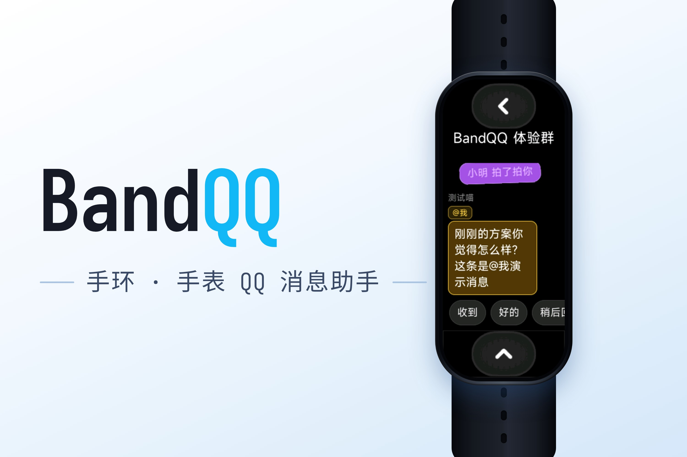
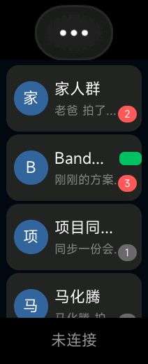
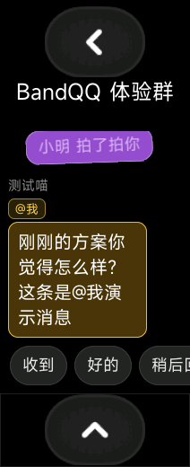
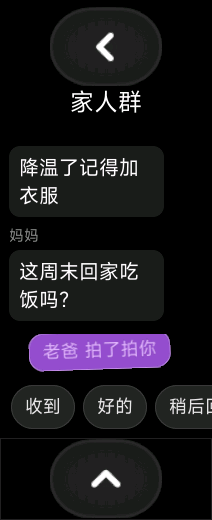
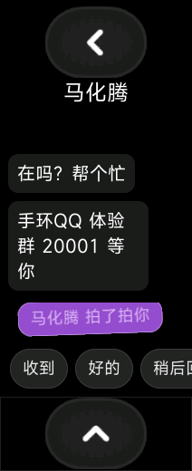

<div align="center">

# 💬 BandQQ 腕间信使：低轨孤星

**小米手环 / Redmi Watch / 小米手表 上的 QQ 消息助手 · Vela 快应用 + Android 同步器双端方案**

[](https://github.com/Gsjsjzhznsz/BandQQ/releases)
[]()
[]()
[](LICENSE)
[](https://github.com/Gsjsjzhznsz/BandQQ/releases)
[](https://github.com/botuniverse/onebot-11)



**手环上直接看 QQ、回 QQ、翻历史、收图。**
手环端运行 Vela 快应用（rpk），手机端运行安卓同步器（APK），经小米互联蓝牙通道实时同步，
协议端对接 OneBot v11（NapCat / Lagrange / LLOneBot / go-cqhttp 均可）。

</div>

---

## 📱 设备分支（v2.10.0 起单 main 分支 + 构建期出包）

单一源码树经 `band-qq/tools/branch-release.js` 构建期生成各系列独立适配包——
designWidth 对准物理屏宽、样式按视觉密度系数换算、**键盘全分支统一 NEORUAA/Vela_input_method 单组件按屏形适配**（v2.13.0）、圆屏安全边距，杜绝 git 多分支漂移：

| 分支包 | 适配设备 | 屏 | designWidth | 键盘（NEORUAA 单组件 · v2.13.0） |
|---|---|---|---|---|
| `bandqq-band` | 小米手环 8 / 9 / 10 / 11 | 192×490 胶囊 | 192 | pill-shaped 弧形屏布局（192 原生） |
| `bandqq-bandpro` | 手环 8Pro / 9Pro / 10Pro | 336×480 方屏 | 336 | rect 方屏布局（336 原生标尺） |
| `bandqq-redmiwatch` | Redmi Watch 5 / 5 eSIM / 6 | 432×514 方屏 | 432 | rect 方屏布局（宽自适应，零换算） |
| `bandqq-xiaomis` | Xiaomi Watch S3 / S4 / S5 | 466×466 圆屏 | 466 | circle 圆屏 QWERTY（480 标尺 ×466/480 换算） |
| `bandqq-universal` | 通用兜底 | 192 | 192 | 同 band |

四分支共用同一组件（内置 circle/rect/pill-shaped 三屏形布局，QWERTY + T9 双键盘，中/英/日三语），共享**全量拼音字库（419 音节 27398 字，频序候选）** + 上游词条分片词库。

> 🧠 AI 协作记忆库：[`MEMORY.md`](MEMORY.md) — 跨会话持久记忆（架构 / bug 台账 / 构建配方）。新会话恢复上下文先读它。

## 界面预览（手环 11 官方 Vela 虚拟机实拍 · 212×520）

| 会话列表（五会话铺满 + @我 标 + 免打扰灰点） | 群聊（@我 金色高亮） |
|:---:|:---:|
|  |  |

| 群聊拍一拍特效 | 私聊拍一拍特效 |
|:---:|:---:|
|  |  |

> 被 @ 时：列表金色「@我」角标 + 聊天页呼吸高亮 + 长震，三重感知；有人拍一拍你：居中紫色特效胶囊 + 晃动动画 + 长震；长按会话可开免打扰。截图由小米官方 Vela 虚拟机（VVD）直接运行 RPK 后 gRPC 实拍，非网页模拟。

## ✨ 功能特性

### 消息同步
- 实时接收 QQ 群聊 / 私聊消息（OneBot v11），@我 提醒、拍一拍特效、撤回灰显
- 彩色首字头像（Stapxs 风格）、未读角标（99+ 封顶）、免打扰、时间分隔条
- **断连补推**：手环重启 / 挂后台期间错过的消息，重连后自动补齐
- 图片消息自动压缩为 96px 缩略图下发（<12KB，并发 2 + 超时兜底）

### 聊天与输入
- **分支适配拼音键盘（NEORUAA 单组件）**：胶囊 / 方屏 / 圆屏三屏形布局，QWERTY + T9 双键盘、中/英/日三语，全量拼音字库 27398 字（生僻字「燚 龘 齉」均可打），候选按常用度排序
- 快捷回复：9 条常用语一键发送（支持 CQ 码、二次确认防误触）
- 历史消息**分页窗口化**：点一次「加载更早」只前移一个窗口（零网络/零卡顿），DOM 恒 ≤ 渲染上限，另有「回到最新」按钮

### OneBot v11 扩展动作（v2.13.0）
- **点赞**（send_like）与**主动拍一拍**（friend_poke）：手环长按会话菜单直达
- **群签到**（send_group_sign）：群会话长按菜单（依协议端支持）
- **表情回应**（set_msg_emoji_like）：聊天页点气泡弹菜单，六大常用回应一键贴
- **撤回自己消息**（delete_msg）：发送应答自动回填 message_id，气泡菜单一键撤回
- **资料查询**（get_stranger_info / get_group_member_info）：私聊查对方、群聊查发言者
- 动作结果实时回推手环（action_result 帧 toast），DevTools 同步提供全部新动作模拟

### eSIM / 独立线路
- **eSIM 独立直连**（参考 merqury-vela）：手表经 @system.fetch 直连 OneBot HTTP API + Bearer token，互联断开自动切换，手机端连接时零手输下发配置
- **AstrBot 本地机器人双包**（v2.12.0 伴侣 / v2.13.0 内嵌）：
  - **瘦包（伴侣版）**：检测/拉起独立的 [AstrBot Bubble](https://github.com/MuFengDR/AstrBot-Bubble-Android-App)，本机 NapCat 一键快连 127.0.0.1
  - **胖包（内嵌引擎版）**：AstrBot Bubble 引擎层（proot + Ubuntu rootfs + 一体化启动脚本）随 APK 内置，点「启动引擎」即得本机 OneBot 服务，开箱即用

### 可靠性
- OneBot WS(:3001) 优先、HTTP(:3000) 自动回退，API 全部走 echo 路由（WS-only 部署也能拉名单、发消息）
- 手机端前台服务 + 无障碍保活锚点 + 后台保活向导；消息落盘 300ms 防抖合并写
- 双端设置互通（表情渲染 / 震动 / 免打扰），夜间勿扰、群聊推送范围手机端判定，手环零开销
- BandQQ DevTools（v1.4.0）：与主 APK 同风格的 miuix 调试器，内置 OneBot 模拟器全动作覆盖

## 📥 安装（GitHub Releases 分发）

到 [**Releases**](https://github.com/Gsjsjzhznsz/BandQQ/releases) 下载对应文件：

1. **手环端**：下载你设备对应的 `bandqq-<分支>-2.13.0.rpk`，经 Vela 快应用开发者模式 / 手环调试助手安装；关于页可核对版本与分支后缀
2. **手机端**（双包二选一，签名同源覆盖安装）：
   - `bandqq-2.13.0-companion.apk` — **瘦包/伴侣版**（约 12MB）：不含引擎，需另装 AstrBot Bubble 或外接协议端
   - `bandqq-2.13.0-bundled.apk` — **胖包/内嵌引擎版**（约 80MB）：内置 AstrBot + NapCat + Ubuntu 容器，设置页一键启动本地引擎
3. **协议端**：NapCat 等开启 WS :3001（推荐）/ HTTP :3000，在同步器设置页填地址与 token，「测试连接」验证
4. 手机与手环经小米运动健康保持连接，打开手环端 QQ 助手即可使用

> 没有协议端？先装 [BandQQ DevTools](https://github.com/Gsjsjzhznsz/BandQQ/releases)（独立调试 APK v1.4.0，内置 OneBot 模拟器）即可完整体验全链路。

## 🏗️ 系统架构

```
┌──────────┐  小米互联蓝牙通道   ┌─────────────────┐   WS :3001 / HTTP :3000   ┌───────────┐
│ 小米手环  │ ◄────────────────► │  BandQQ 同步器   │ ◄────────────────────────► │  OneBot    │
│ Vela快应用│    interconnect    │  (Android APK)  │        OneBot v11          │ NapCat 等  │
└──────────┘                    └─────────────────┘                            └───────────┘
   band-qq/ (rpk)                  android-sync/        ▲                        QQ 服务端
      ▲                                  │               └── 也可跑在本机：
      └── eSIM 独立直连（@system.fetch）──┘       AstrBot Bubble / Termux / DevTools
```

## 目录结构

```
band-qq/          手环端 Vela 快应用源码（aiot-toolkit 构建；tools/branch-release.js 分支出包）
  src/components/InputMethod/   NEORUAA/Vela_input_method 键盘组件（三屏形单组件）
  scripts/merge_dict_neoruaa.py 全量字库合入 NEORUAA 词库（27398 字）
android-sync/     安卓同步器源码（Kotlin + Compose + miuix）
  app/            主模块（productFlavors：companion 瘦包 / bundled 胖包）
  astrbot-engine/ 胖包内嵌 AstrBot 引擎（proot 套件 + Ubuntu rootfs + 启动脚本）
devtools/         BandQQ DevTools 调试器源码（v1.4.0 miuix 风格 OneBot 模拟器）
scripts/          构建脚本（build-rpk.sh / build-apk.sh / setup-buildenv.sh 等）
docs/             NapCat 配置、签名说明等文档
legacy/           历史归档（v1.1.0 源码包、旧变体快照、全量字库出处）
```

## 🛠️ 从源码构建

```bash
# 手环端 rpk（四分支一次全出，或单分支指定）
cd band-qq && node tools/branch-release.js          # band / bandpro / xiaomis / redmiwatch

# Android 双包（瘦包伴侣版 + 胖包内嵌引擎版）
bash scripts/setup-buildenv.sh                       # JDK17 + Gradle 8.13 + SDK 一键重建
cd android-sync && JAVA_HOME=/path/to/jdk-17 \
  gradle assembleCompanionRelease assembleBundledRelease -x lint
# 产物：app/build/outputs/apk/{companion,bundled}/release/bandqq-2.13.0-{companion,bundled}.apk

# DevTools（独立调试器）
gradle :devtools:assembleRelease
```

构建说明见 `scripts/README.md`；字库再生成：`python3 band-qq/scripts/merge_dict_neoruaa.py`（BandQQ 全量字库合入 NEORUAA cn.txt，频序拱顶保留）。

## 📦 更新日志

### v2.14.0（当前版本 · vc54）

> 四件事：**胖包 AstrBot 独立标签页**（bundled flavor 底栏新增第 4 页「AstrBot」——引擎状态/启动/停止/NapCat 探测/引擎日志（80 行）/一键写入并保存本机直连地址全在标签页完成，设置页仅留指引卡；瘦包 4 页不变，Tab 集按 flavor sourceSet 编译期二选一）+ **键盘两处非手环机型修复**（①空输入时键盘只显示一半、敲一键才恢复——根容器 height:auto 在部分固件首帧测量坍缩，改 JS 侧显式总高（circle 321 / rect 283 / pill 333，rect·pill 恒预留 28px 拼音行，内容高度不再随输入变化），②输入预览行同步受此保护；xiaomis 的 466/480 换算常量同步入构建脚本）+ **智能自动渲染器**（AstrBot/机器人/分享消息首次在手环可读——json 卡片提取 meta.prompt/音乐·新闻·小程序标题、xml 卡片取 title/brief、markdown 降纯文本、合并转发/表情包/GIF/文件名/位置/分享/戳一戳/骰子等 20+ 段型，CQ 字符串同规则，800 字符护栏；手机端 OneBotParser 与手环端兜底 protocol.js 同步升级）+ **libbusybox.so 缺失修复**（EngineManager bin 组装双通道：nativeLibraryDir 缺文件时从 APK 内 lib/arm64-v8a/ 直取，报错附带设备 ABI 与路径诊断）。

- 验证：手环端 node 单测 90 测 89 过（新增渲染器 10 项全绿，api.test.js 1 例存量环境失败基线一致）；bundled/companion 双 APK 编译 + badging vc54/2.14.0；四分支 rpk 解包断言全 PASS（显式高度常量/恒预留拼音行/渲染器标记）
- 版本：APP/手环 2.14.0（vc54）单轨延续

<details>
<summary><b>v2.13.0</b> — 键盘全分支换装 NEORUAA + AstrBot 胖/瘦双 APK + OneBot v11 扩展 + DevTools miuix 重写 + AGPL（点击展开）</summary>

> 四件事：**键盘全分支换装 NEORUAA/Vela_input_method**（v2.12.0 的 Revise fork 三快照退役，改用上游单组件内置 circle/rect/pill-shaped 三屏形布局，构建期只做 screentype 写入 + xiaomis 圆屏 466/480 换算；词库升级为 NEORUAA 分片按需加载体系，BandQQ 全量 27398 字合入 cn.txt 频序拱顶保留）+ **AstrBot 胖/瘦双 APK**（胖包 bundled 版把 AstrBot Bubble 的引擎层完整内嵌——proot 套件 + 64MB Ubuntu rootfs + 一体化启动脚本，设置页安装/启动/停止/日志/端口探测全流程卡片；瘦包 companion 版保留 v2.12.0 伴侣模式，双包同 applicationId 二选一安装）+ **OneBot v11 特性扩展**（点赞 send_like / 主动拍一拍 friend_poke·group_poke / 群签到 send_group_sign / 表情回应 set_msg_emoji_like / 撤回自己消息 delete_msg / 资料 get_stranger_info·get_group_member_info，手环长按菜单与聊天页气泡菜单直达，发送应答自动回填 message_id，DevTools 同步模拟）+ **DevTools 1.4.0 miuix 重写**（与主 APK 同一套 HyperOS 设计语言，主题跟随系统深浅色）+ **许可证 MIT → AGPL-3.0**。

- 验证：双 APK（companion 12MB / bundled 80MB）+ devtools 编译全过，badging vc53/2.13.0 与 vc7/1.4.0，EngineManager/EngineService 多 dex 标记 FOUND，rootfs/proot 资产入包确认；手机端单测 104 测 104 过，手环端 79 过（存量基线一致）
- 版本：APP/手环 2.13.0（vc53）单轨延续，DevTools 1.4.0（vc7）
</details>

<details>
<summary><b>v2.12.0</b> — 键盘分支原生化 + 全量拼音字库 + AstrBot 本地伴侣 + README 项目化（点击展开）</summary>

> 三件事：**键盘分支原生化**（用户报告「以前给其他分支单独适配的键盘不见了」——v2.10.0 分支包里非手环机型仍被塞着胶囊键盘只做数值缩放；现按分支换装三套原生布局：bandpro/redmiwatch 方屏版、xiaomis 圆屏 QWERTY 版，方屏修上游两处笔误 onscroll 拼写/percent 绑定，方屏符号键扩充 ～！？【】「」、·）+ **全量拼音字库**（legacy 变体 20924 字全量池回归，与现役频序字典合并为 **419 音节 27398 字**，常用字频序拱顶不变、生僻字可打）+ **AstrBot 本地伴侣**（集成 MuFengDR/AstrBot-Bubble-Android-App：设置页新增 AstrBot 卡片，检测/一键拉起 com.astrbot.astrbot_bubble、探测本机 NapCat :3001/:3000 就绪状态、一键填入 127.0.0.1 本机地址；不做二进制合并——对方是 Flutter + 64MB Ubuntu rootfs 独立应用，伴侣模式才是性能与体积最优解）+ **README 项目化改版**。

- 验证：四分支 rpk 解包 68 项断言全 PASS（新增键盘布局类残留检查/按键宽换算/滚动总宽词边界正则/全量字库罕见字标记）；node 单测 80 测 79 过（存量基线一致）；APK badging vc52/2.12.0 + AstrBotBridge 多 dex 标记 FOUND
- 版本：RPK 四分支+通用 2.12.0（vc52，versionName 带分支后缀）+ 同步器 2.12.0（vc52，签名同源 af8819e2）
</details>

<details>
<summary><b>v2.10.0</b> — 分支级界面适配 + 历史分页窗口化 + eSIM 独立直连 + 性能四项（点击展开）</summary>

- **分支级界面适配**：根治大屏「缩放异常」——单一 designWidth=192 在 432 宽屏被固件放大 2.25 倍；改为构建期四分支包（band 192 / bandpro 336 / xiaomis 466 / redmiwatch 432），样式值按视觉密度系数换算非等比缩放，圆屏安全边距
- **历史消息分页窗口化**：「历史达到额度就异常」根修——渲染 DOM 恒 ≤ renderCap 与数据层解耦，点一次「加载更早」本地窗口前移一批零网络，本地到头才拉手机端，新增「回到最新」
- **eSIM 独立直连线路**：参考 merqury-vela，@system.fetch 直连 OneBot HTTP + Bearer token，direct_config 帧下发配置，sendUpstream 三态编排，chat 4s/列表 20s 前台轮询熄屏即停
- **性能四项**：消息落盘 300ms 防抖合并写 / 排序幂等 WeakSet / 数据层 100→120 / 启动冗余 send 清理
</details>

<details>
<summary><b>v2.9.x</b> — 真实 NapCat 接入五连修（点击展开）</summary>

- **v2.9.6**：RW5E 等非手环设备二级页黑屏根修（flex:1 滚动视口高度计算失败 → 四页统一 absolute 铺满同构改造）；全设备版本号统一（APK/rpk 同版同 vc 单轨）
- **v2.9.5**：发送链路 WS 回退（WS 能连就能发）+ compose 双发根治（先查会话类型只发一条）+ requestApi baseUrl 丢弃回归修复
- **v2.9.4**：群聊识别成个人联系人根治（get_group_info 补名固化 + 蓝「群」徽章）+ 联系人 WS API 通道与 30s×10 重试 + 快捷回复二次确认 + 演示模式清理 + 主页日志面板防坍缩
- **v2.9.1**：主页面列表铺满整屏（Vela scroll 背景只绘制内容高度的引擎行为）；同步器落盘文件日志（免 root 排查 + 导出 + 环境自检 + 授权全链路）
</details>

<details>
<summary><b>v2.7.0 ~ v2.9.0</b> — 自动拉起 / 拍一拍 / 免打扰 / DevTools（点击展开）</summary>

- **v2.9.0**：拍一拍全链路（私聊也有提醒）+ 会话免打扰（红点变灰 + 不拉起）+ 拉起范围收敛「仅@我和拍一拍」+ 演示模式彩蛋
- **v2.8.x**：DevTools 1.x 系列（OneBot 模拟器 / 主线程网络 IO 根修 / 版本互认 / 断连归因）+ 双端设置互通 + 双端关于页 + @我 类型断裂根修
- **v2.7.0**：快应用自动拉起（launchWearApp + 预告通知 + 取消机制）+ 头像组件 + 快捷回复即时同步 + @我 呼吸动效
</details>

<details>
<summary><b>v2.1.0 ~ v2.6.0</b> — 性能架构重构与 stapxs 特性回归（点击展开）</summary>

- **v2.6.0**：预测性返回重做（KernelSU 原版对齐 + PredictiveBackHandler）+ 手环表情支持（80 项映射）+ Vela 虚拟机验收体系 + Band 11 适配
- **v2.5.0**：数组段格式 @我 修复 + Band 11 弹性布局 + 新消息震动 + 测试推送模拟器（9 场景）
- **v2.4.x**：保活向导 / 崩溃三层防御 / 撤回灰显 / 勿扰 / 群聊推送范围
- **v2.1.0**：性能架构重构（手机端预处理 + 手环零计算直渲染）+ 未读角标 / 快捷回复 / 历史翻页 / 彩色头像回归 + miuix UI
- **v1.1.1**：会话列表抖动根治 + 字库全量扩展 + 历史翻页重写 + 冷启动丢消息三层修复
</details>

## 🙏 引用项目与致谢

本项目站立在这些开源项目之上，排名不分先后：

| 项目 | 引用方式 |
|---|---|
| [**NEORUAA/Vela_input_method**](https://github.com/NEORUAA/Vela_input_method) | 手环端拼音键盘的直接来源（v2.13.0 起全分支统一换装其单组件：circle/rect/pill-shaped 三屏形布局，QWERTY+T9，中/英/日三语），BandQQ 分支构建期写入屏形并做圆屏尺寸换算，另合入全量字库 27398 字 |
| [**AetherZeng1145/Vela-Input-Method-Revise**](https://github.com/AetherZeng1145/Vela-Input-Method-Revise) | 上述键盘的活跃 fork，v2.12.0 及之前版本键盘分支化的基座，其方屏适配经验反哺了换装换算规则 |
| [**MuFengDR/AstrBot-Bubble-Android-App**](https://github.com/MuFengDR/AstrBot-Bubble-Android-App) | AstrBot 本地机器人引擎层来源：胖包（bundled）内嵌其 proot 套件 + Ubuntu rootfs + 一体化启动脚本；瘦包（companion）检测/拉起独立 App 一键快连 |
| [**AstrBot**](https://github.com/AstrBotDevs/AstrBot) | 多平台聊天机器人框架，经 AstrBot Bubble 接入后可为 QQ 号提供大模型自动回复 |
| [**Astroptis/band-qq-assistant**](https://github.com/Astroptis/band-qq-assistant) | 本项目上游，v2.x 以上游 main 为底重写性能架构并回归 stapxs 特性 |
| [**stapxs/stapxs-qq-lite**](https://github.com/ImStapxs/stapxs-qq-lite)（含 Lite-X） | 气泡布局 / 彩色首字头像等视觉范式的参考 |
| [**CoraTech-Wear/merqury-vela**](https://github.com/CoraTech-Wear/merqury-vela) | eSIM 机型独立直连线路的实现参考（@system.fetch 直连 OneBot HTTP） |
| [**miuix**](https://github.com/miuix-kotlin-multiplatform/miuix) | Android 端 HyperOS 风格 Compose UI 框架（主 APK 与 DevTools 共用） |

> 感谢小米 Vela 团队的快应用生态与官方 VVD 虚拟机——本项目的界面验收全部由其 gRPC 实拍完成。

## 📄 许可证

本项目自 v2.13.0 起以 **[GNU Affero General Public License v3.0（AGPL-3.0-only）](LICENSE)** 发布——
主体代码此前为 MIT，切换为 AGPL 以确保衍生项目（含网络服务化部署）同样开源。
版权行：`Copyright (C) 2026 Astroptis / Gsjsjzhznsz contributors`。

第三方组件以其自身许可证为准（均与 AGPL-3.0 兼容或以独立作品边界引用）：

| 组件 | 许可证 |
|---|---|
| NEORUAA/Vela_input_method（键盘组件与词库） | BSD-3-Clause（代码）/ Apache-2.0（词库数据），词库按其 README 说明使用 |
| MuFengDR/AstrBot-Bubble-Android-App（引擎层：proot 套件/rootfs/启动脚本） | BSD-3-Clause（基于 nightmare-space 系项目），胖包内嵌保留其版权声明 |
| miuix | MIT |
| AstrBot（运行时按需容器内安装） | AGPL-3.0，与本许可证兼容 |

> 关于页显示的版本号与许可证信息请以 [Releases](https://github.com/Gsjsjzhznsz/BandQQ/releases) 最新发布说明为准。

---

> 关键词：小米手环9 / Mi Band 9 / 小米手环10 / 小米手环11 / 小米手环QQ / 小米手环9 Pro / Redmi Watch / Xiaomi Watch S / Vela 快应用 / 快应用 rpk / OneBot v11 / NapCat / Lagrange / LLOneBot / go-cqhttp / QQ 消息同步 / 手环回复QQ / 手环看QQ / 蓝牙消息助手 / eSIM 手表 / AstrBot / wearable QQ / smartband chat
